# Онлайн платформа для обучения

Программа, которая позволяет учителям создавать уроки с тестами, а ученикам проходить их. 
 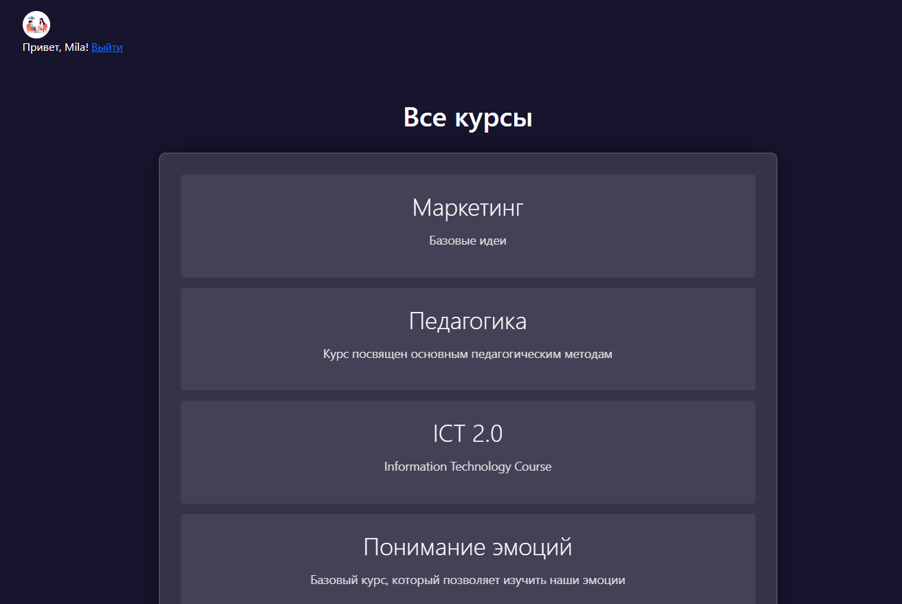  

## Функционал
### Для учеников
- Регистрация и авторизация
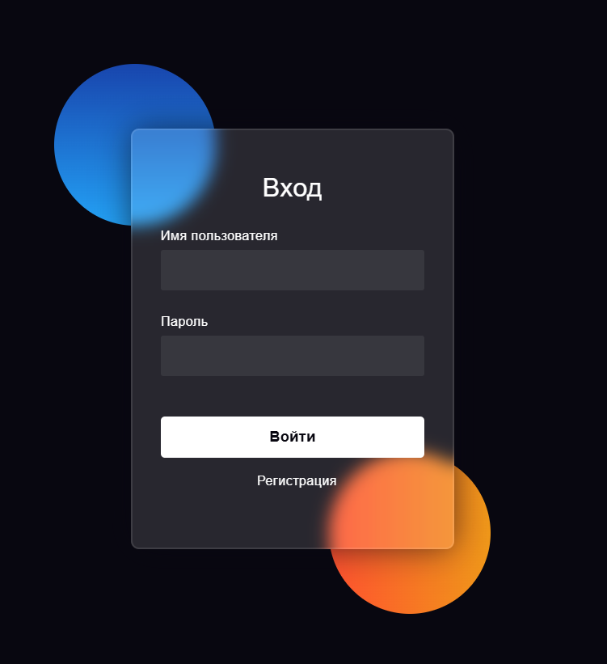  
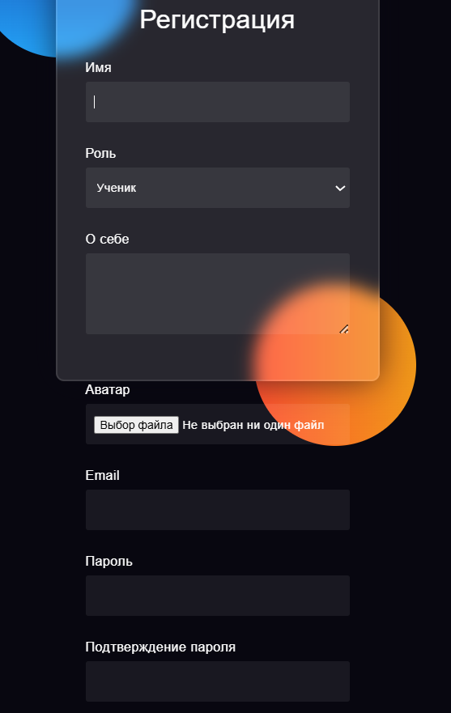  
- Возможность записываться на курсы
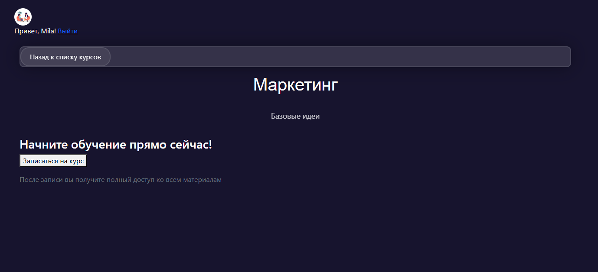  
- Возможность просматривать содержание курса, на который пользователь был записан
- Доступ к прогрессу по курсу
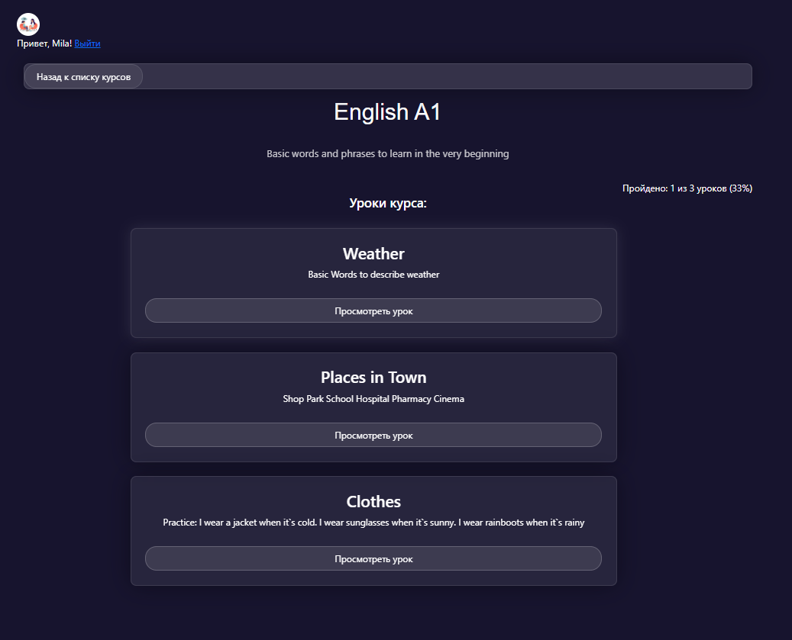  
- Возможность скачивать материалы, если они были прикреплены учителем
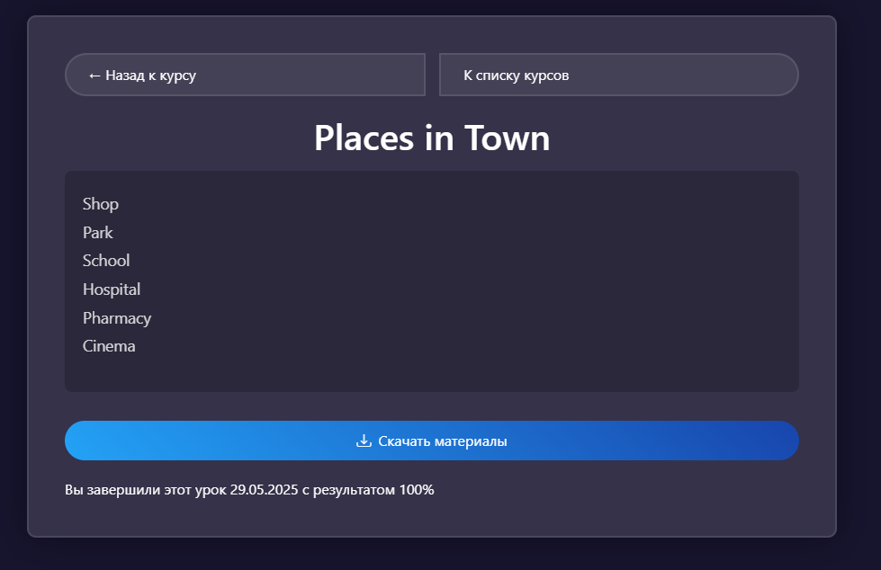  

### Для преподавателей
 - Создание и редактирование уроков к курсам
 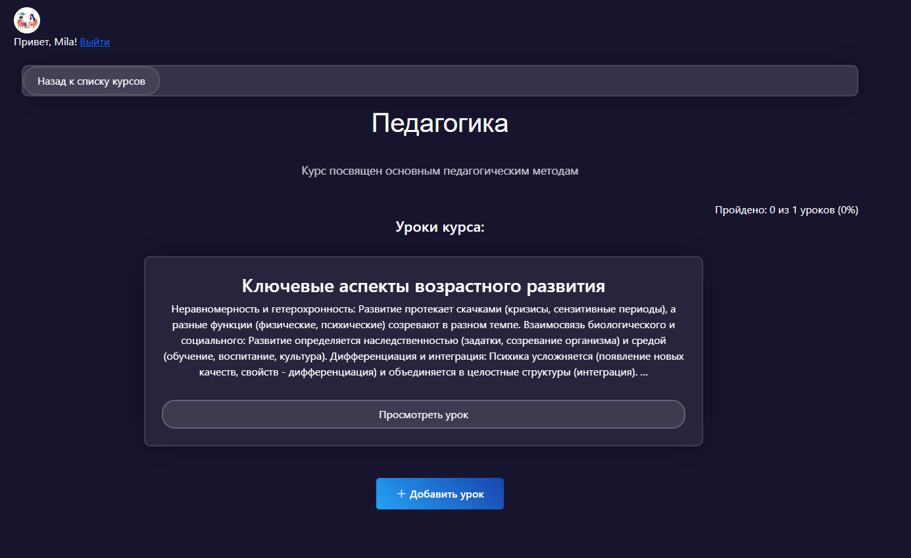  
 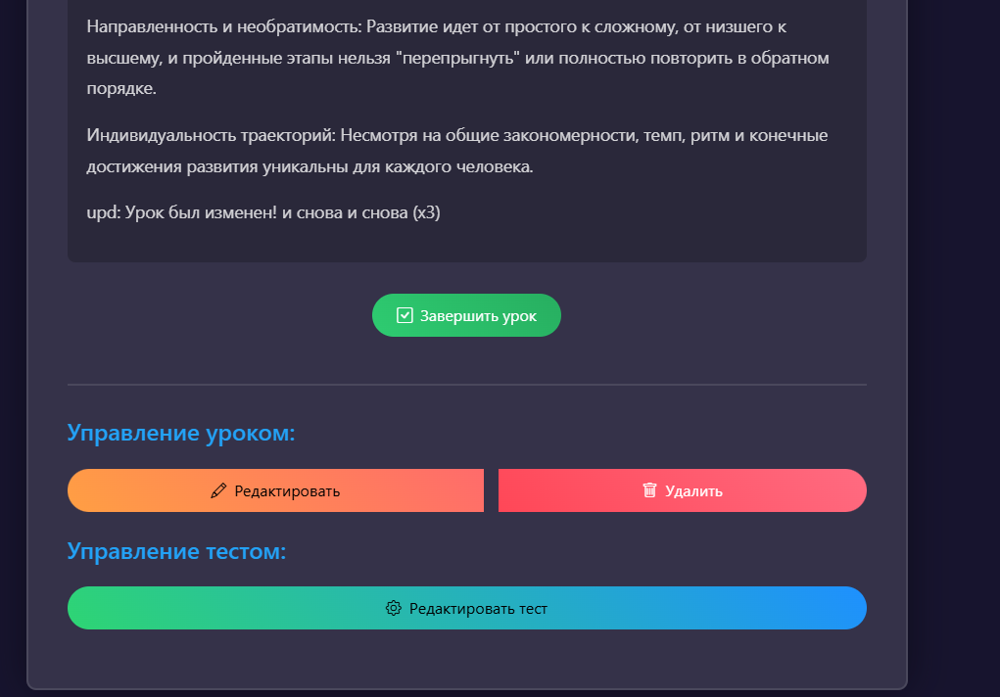  
 - Загрузка файлов к урокам
 - Добавление тестов с вопросами
 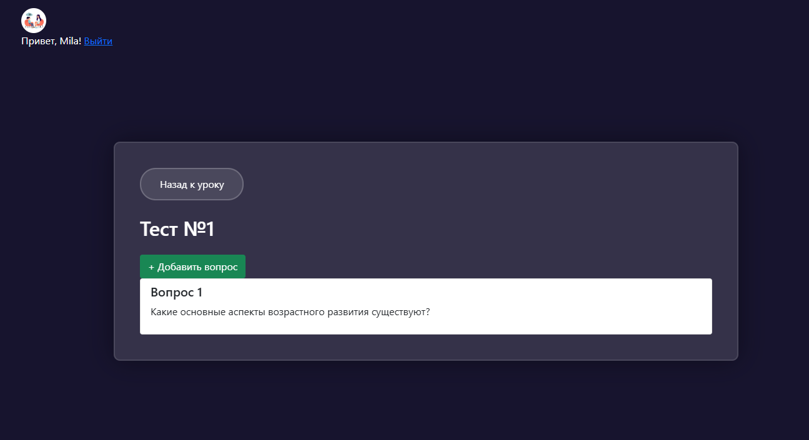  
 - Возможность удалять уроки
 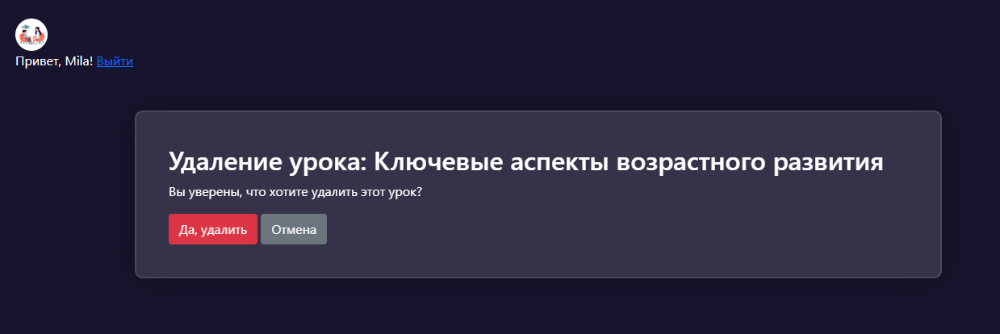  

### Общее

Платформа оснащена интуитивной системой навигации, включая удобную пагинацию для комфортного просмотра курсов.  
 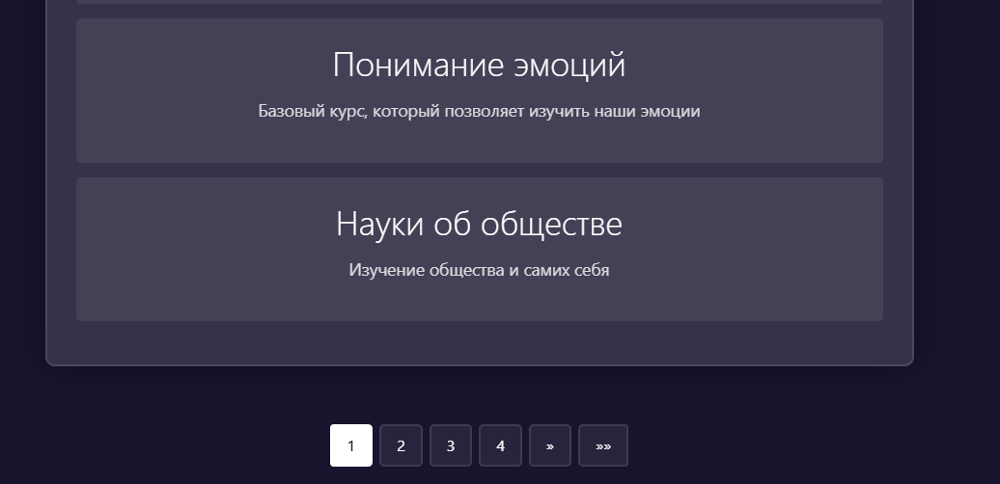  
Каждый курс находится под полным контролем назначенного преподавателя: только он имеет право создавать уроки, корректировать их содержание или удалять материалы.  
Для учеников реализован доступ к изучению контента в режиме «только для просмотра» — они могут осваивать материалы, но не вносить изменения в структуру курса. 
Также есть возможность скачивать прикрепленные к уроку материалы. 
Доступ к платформе возможен только после прохождения обязательной регистрации.
Курсы для преподавателя назначает администратор, после чего преподаватель получает возможность управлять курсом.

## Установка
1) Необходимо клонировать репозиторий в отдельную папку. Сделать это можно при помощи команды: 
`git clone https://github.com/Anastasia-l/Project_for_online_school` 

2) В этой папке требуется создать виртуальное окружение:
`python -m venv venv`
и активировать его:
`venv\Scripts\activate`

3) Затем нужно установить зависимости из файла **requirements.txt**:
`pip install -r requirements.txt`

## Демонстрация с тестовыми данными
4.1) Требуется запустить сервер:
`python manage.py runserver`
Так как база данных уже содержится в репозитории, то все курсы и пользователи, включая администратора, уже были переданы. 

Если требуется проверка на тестовых данных, то на этом всё!
Теперь проект будет доступен по адресу: http://127.0.0.1:8000/

**Тестовые пользователи**: 
- Администратор (superuser):
- - Логин: Ann_st
- - Пароль: MNuummppyyykkk

- Преподаватель курсов: "Педагогика", "Понимание эмоций", "Науки об обществе" - Mila
- - Логин: Mila
- - Пароль: mila3000mila

- Студент: Max
- - Логин: Max
- - Пароль: max3000max
- Все остальные пользователи имеют одинаковые логины и пароли, в соответствии с их именем: логин = (имя пользователя), пароль = (имя3000имя). 
Все данные вымышлены и используются исключительно для демонстрации!
 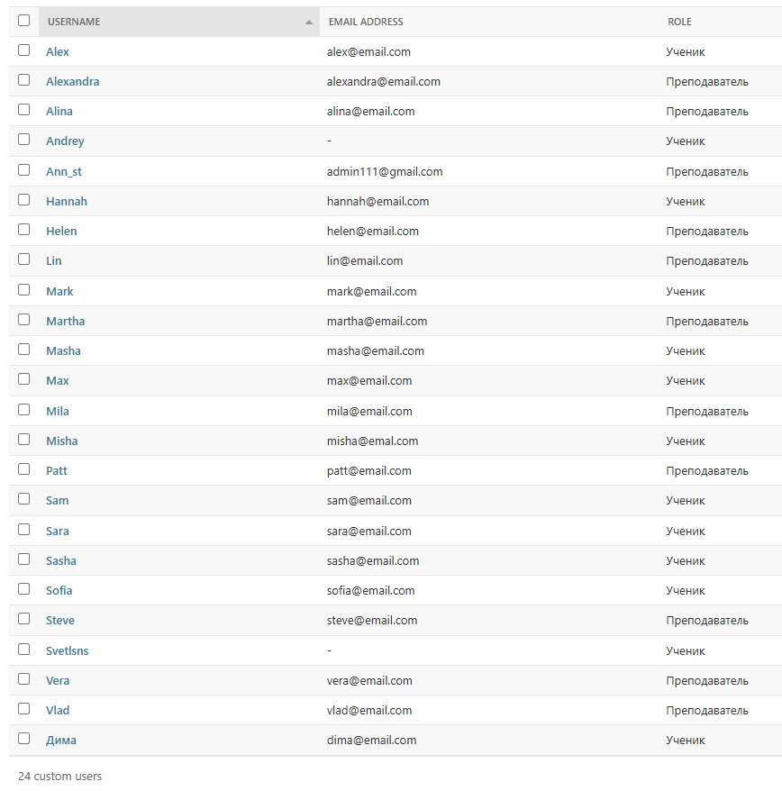
  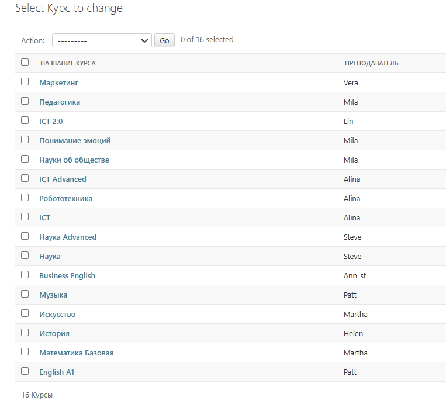    

## Запуск программы с созданием собственных данных
4.2.1) Для использования программы без тестовых данных требуется удалить базу данных **db.sqlite3** из директории. Это позволит наполнять платформу собственными курсами и пользователями.

4.2.2) Теперь следует применить миграции:
`python manage.py migrate`

4.2.3) Создайте администратора (superuser):
`python manage.py createsuperuser`
Здесь потребуется ввести имя пользователя (username) и задать пароль для доступа к сайту администратора.

4.2.4) Затем требуется запустить сервер:
`python manage.py runserver`

Готово! 

Теперь проект будет также доступен по адресу: http://127.0.0.1:8000/
Сайт администратора доступен по адресу: 
http://127.0.0.1:8000/admin/

Здесь вы можете регистрировать собственных пользователей, управлять курсами через сайт администратора, наполнять курсы уроками через предоставление доступа преподавателям к курсу, а также использовать все возможности платформы, но уже с использованием собственных данных!

